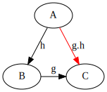

# Category Theory Basics

The basics of Category Theory is quite easy and gives you a minimalistic tool to view, create, and analyse structure, such as programs and sourcecode.

## Objects and Morphisms

The basic building blocks of Category Theory are Objects and Morphisms (also called Arrows). With these very simple concepts complex structures can be described and handled.

### Morphisms

Morphisms are a relationship between Objects, it can be a mapping like a function but it does not have to be. A counter example is `>=` which is a valid Morphism (in some categories).

Morphisms are also sometimes called arrows and are also written like a arrow `->`. This is probably where the lambda arrow comes from in languages like java and javascript.

### Objects

Serves as the end and starting points of Morphisms and are quite uninteresting in them selves. Usually a Object serves as a container for multiple value with in a specific classification but can also be concrete and mean a specific value.

Objects are written like a circle or a dot like this `.`.

## Categories

For something to count as a Category it needs to follow these simple rules.

### Composition

If you have two Morphisms that share a common Object, one that is the endpoint of one and start of the other then there must be one that is the composition of them.

`h` is a Morphism between `A` and `B`. `g` is a Morphism between `B` and `C`. Therefore there exists a Morphism `g.h` (g after h) between `A` and `C`. 

### Identity

Every Object needs to have a Morphism that has it self as both the beginning and the end, `A->A`.

This Morphism should also work as a unit under composition. Which means that if you compose any Morphism (that is a valid candidate for composition) with a Identity Morphism you should get the other one back. `A-id->A->B = A->B` and `A->B-id->B = A->B`.

